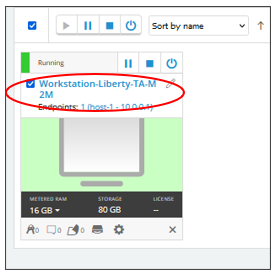

<h2 style="color:black">Day 1: Accessing lab environment</h2>


  


1. Go to the Attendee Lab URL from the **Day 1 Labs** menu item, 

    From the Day 1 Labs menu item, select the Lab Environment URL for the specific lab(s) you want to run

    

    <br/>
 
2. Enter the workshop password: **websphere** and click **Submit** button

    

    <br/>


3. Click the URL to your environment and enter the password that is displayed on the page, which is unique to your environment. 

    


4. The VMs will be shown, and should already be STARTED

    <h4 style="color:red">**DO NOT start / stop VMs unless instructed to do so!**</h4>
  
    

    You will see a screen with one or more VMs, depending on the specific lab. 

    <br/>
 
5. Follow the lab guide for instructions for accessing the specific VM, credentials, etc.  

    **Note: **The lab guides include the information for which VM to open, how to login to the VM, login credentials, etc.  

  
  
  
### Liberty lab fix for pom.xml file
 
  **Replace the contents of pom.xml file in the following directory, with this new content.**
 
  /home/ibmdemo/Student/labs/devmode/demo-project
 
  and 
 
  /home/ibmdemo/Student/labs/devmode/guide-getting-started

 

```xml 
<?xml version='1.0' encoding='utf-8'?>
  <project xmlns="http://maven.apache.org/POM/4.0.0"
         xmlns:xsi="http://www.w3.org/2001/XMLSchema-instance"
         xsi:schemaLocation="http://maven.apache.org/POM/4.0.0 http://maven.apache.org/xsd/maven-4.0.0.xsd">
    <modelVersion>4.0.0</modelVersion>

    <groupId>io.openliberty.guides</groupId>
    <artifactId>guide-getting-started</artifactId>
    <version>1.0-SNAPSHOT</version>
    <packaging>war</packaging>

    <properties>
        <maven.compiler.source>1.8</maven.compiler.source>
        <maven.compiler.target>1.8</maven.compiler.target>
        <project.build.sourceEncoding>UTF-8</project.build.sourceEncoding>
        <project.reporting.outputEncoding>UTF-8</project.reporting.outputEncoding>
        <!-- Liberty configuration -->
        <liberty.var.default.http.port>9080</liberty.var.default.http.port>
        <liberty.var.default.https.port>9443</liberty.var.default.https.port>
    </properties>

    <dependencies>
        <!-- Provided dependencies -->
        <dependency>
            <groupId>jakarta.platform</groupId>
            <artifactId>jakarta.jakartaee-api</artifactId>
            <version>8.0.0</version>
            <scope>provided</scope>
        </dependency>
        <dependency>
            <groupId>org.eclipse.microprofile</groupId>
            <artifactId>microprofile</artifactId>
            <version>3.3</version>
            <type>pom</type>
            <scope>provided</scope>
        </dependency>
        <!-- For tests -->
        <dependency>
            <groupId>org.junit.jupiter</groupId>
            <artifactId>junit-jupiter</artifactId>
            <version>5.6.2</version>
            <scope>test</scope>
        </dependency>
        <dependency>
            <groupId>org.apache.cxf</groupId>
            <artifactId>cxf-rt-rs-client</artifactId>
            <version>3.3.6</version>
            <scope>test</scope>
        </dependency>
        <dependency>
            <groupId>org.apache.cxf</groupId>
            <artifactId>cxf-rt-rs-extension-providers</artifactId>
            <version>3.3.6</version>
            <scope>test</scope>
        </dependency>
        <dependency>
            <groupId>org.glassfish</groupId>
            <artifactId>javax.json</artifactId>
            <version>1.1.4</version>
            <scope>test</scope>
        </dependency>
    </dependencies>

    <build>
        <finalName>${project.artifactId}</finalName>
        <plugins>
            <!-- Enable liberty-maven plugin -->
            <plugin>
                <groupId>io.openliberty.tools</groupId>
                <artifactId>liberty-maven-plugin</artifactId>
                <version>3.3.4</version>
                 <configuration>
                    <assemblyArtifact>
                        <groupId>io.openliberty</groupId>
                        <artifactId>openliberty-javaee8</artifactId>
                        <version>21.0.0.3</version>
                        <type>zip</type>
                    </assemblyArtifact>
                </configuration>
            </plugin>
            <plugin>
                <groupId>org.apache.maven.plugins</groupId>
                <artifactId>maven-war-plugin</artifactId>
                <version>3.2.3</version>
            </plugin>
            <plugin>
                <groupId>org.apache.maven.plugins</groupId>
                <artifactId>maven-surefire-plugin</artifactId>
                <version>2.22.2</version>
            </plugin>
            <!-- Plugin to run functional tests -->
            <plugin>
                <groupId>org.apache.maven.plugins</groupId>
                <artifactId>maven-failsafe-plugin</artifactId>
                <version>2.22.2</version>
                <configuration>
                    <systemPropertyVariables>
                        <http.port>${liberty.var.default.http.port}</http.port>
                    </systemPropertyVariables>
                </configuration>
            </plugin>
        </plugins>
    </build>
</project>
``` 
  
  
  
  
  
  
  
  
  